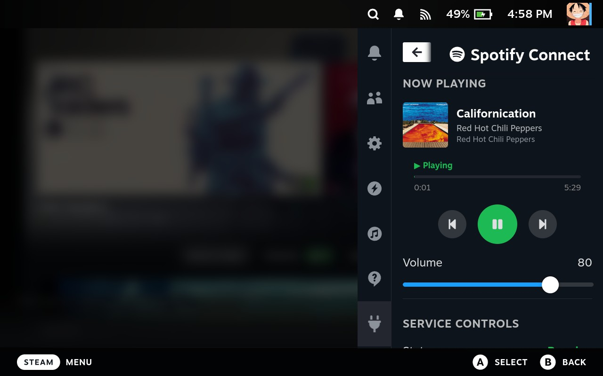

# Spotify Connect Speaker for Steam Deck

Turn your Steam Deck into a Spotify Connect speaker - stream your music and control playback directly from the Quick Access menu.

## Features

- **Spotify Connect Support** - Your Steam Deck appears as a speaker in the Spotify app on your phone, tablet, or computer
- **Quick Access Controls** - Play, pause, skip tracks without leaving Gaming Mode
- **Background Playback** - Music keeps playing while you game or use other apps
- **No Spotify Client Required** - No need to install the heavy Spotify desktop app on your Steam Deck
- **Lightweight** - Minimal CPU and memory usage, leaving all the power for your games
- **Auto-start Option** - Automatically start the Spotify Connect service when your Steam Deck boots

## Requirements

- Steam Deck with [Decky Loader](https://github.com/SteamDeckHomebrew/decky-loader) installed
- Spotify Premium account (required for Spotify Connect)

## Installation

1. Download the last zip from the github [releases](https://github.com/lukasvdberk/decky-spotify-connect-speaker/releases) page
2. Open the Quick Access menu on your Steam Deck
3. Navigate to the Decky plugin settings
4. And select the option to install from a ZIP file

## Usage

1. Open the Quick Access menu and select the Spotify Connect Speaker plugin
2. Enable the service using the toggle
3. Open Spotify on your phone, tablet, or computer
4. Select your Steam Deck from the available devices
5. Start playing music - it will stream to your Steam Deck!

Use the playback controls in the plugin to play/pause or skip tracks.

## Troubleshooting

If you encounter issues:

1. Make sure the service is running (check the status in the plugin)
2. Ensure your Steam Deck and Spotify device are on the same network
3. Try restarting the service using the restart button
4. Check the logs in the plugin settings for error messages

## Issues & Support

Having problems or want to request a feature? Please [create an issue](https://github.com/lukasvdberk/decky-spotify-connect-speaker/issues/new/choose) on GitHub.

## License

BSD-3-Clause
